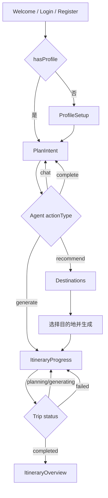

# Pathfinder Agent

<div align="center">

[](https://openjdk.org/)
[](https://spring.io/projects/spring-boot)
[](https://vuejs.org/)
[](https://github.com/langchain4j/langchain4j)
[](LICENSE)

**AI 旅行规划平台**

采用结构化意图抽取 + 确定性路由 + LangGraph4j 状态机编排，实现对话、推荐与行程生成闭环

[特性](#核心特性) • [架构](#架构说明) • [Prompt](#关键-prompt-与-vibe-思路) • [AI 调用](#ai-调用逻辑流式--function-calling-等) • [部署](#部署步骤含-dns--https) • [配置](#配置说明)

</div>

---

## 目录

- [核心特性](#核心特性)
- [技术栈](#技术栈)
- [架构说明](#架构说明)
- [关键 Prompt 与 Vibe 思路](#关键-prompt-与-vibe-思路)
- [AI 调用逻辑（流式 / function calling 等）](#ai-调用逻辑流式--function-calling-等)
- [当前业务流程与调用链](#当前业务流程与调用链)
- [性能指标](#性能指标)
- [快速启动](#快速启动)
- [部署步骤（含 DNS / HTTPS）](#部署步骤含-dns--https)
- [配置说明](#配置说明)
- [项目结构](#项目结构)
- [贡献指南](#贡献指南)

## 核心特性

### 智能 Agent 架构
- **当前主链路**：`UnifiedReActAgent` 采用 `StructuredIntentExtractor → IntentRouter → ToolRegistry.execute` 的单次决策执行模式
- **工具治理**：统一管理 `conversation / recommend_destinations / generate_itinerary` 三类工具，支持工具级超时与错误兜底
- **上下文管理**：`AgentStateStore` + Redis 持久化会话状态，支持多轮对话上下文
- **三层超时控制**：Agent 总超时、LLM 超时、工具超时，防止请求卡死
- **五层安全防护**：输入验证 → 恶意检测 → 内容净化 → Prompt 转义 → 日志脱敏

### LangGraph 状态机工作流
- **推荐流程（5 节点）**：意图分析 → AI 生成候选 → 区域过滤 → 排序选择 → 生成推荐理由
- **推荐结果 Top3**：`RankAndSelectNode` 固定输出 Top 3 推荐
- **行程流程（6 节点）**：任务规划 → RAG 检索 → 预算验证 → 行程生成 → 质量反思 → 保存
- **可选路线优化**：开启 `agent.route-optimization.enabled=true` 时插入 `route_optimization` 节点
- **异步后处理**：主链路保存完成后，后台继续地理编码和路线优化，不阻塞前端查看行程

### RAG 增强检索
- **向量检索**：Chroma 存储旅行知识库，行程生成流程通过 `RAGSearchTool` 检索真实景点信息
- **阈值过滤**：仅保留相似度 `score > 0.7` 的检索结果
- **减少幻觉**：基于真实知识片段生成活动建议，降低编造内容风险
- **知识库管理**：支持动态导入旅游指南，自动向量化存储

### 用户流程闭环
- **核心流程**：`/plan/intent` → `/plan/destinations` → `/itinerary/progress/:tripId` → `/itinerary/overview` → `/itinerary/edit/:tripId`
- **生成状态闭环**：`/api/trips/{tripId}/status` 返回 `status/progress/currentStep`，失败时返回 `errorMessage`
- **编辑保存闭环**：`saveEdit` 将快照持久化到 `itinerary_versions` 并推进 `trips.current_version`
- **API 契约统一**：前端统一以 `src/api/request.js` 作为唯一 request 语义，`src/utils/request.js` 保留兼容导出

### 异步任务处理
- **进度追踪**：Redis 实时追踪行程生成进度（0% → 100%）
- **后台地理编码**：异步批量处理地理坐标查询，不阻塞主流程
- **优雅降级**：主 AI 服务失败自动切换备用服务

## 技术栈

### 后端技术
| 技术 | 版本 | 用途 |
|------|------|------|
| **Spring Boot** | 3.5.6 | 应用框架 |
| **Java** | 17 | 编程语言 |
| **LangChain4j** | 1.10.0 | AI 集成框架 |
| **LangGraph4j** | 1.8.0-beta3 | 状态机工作流 |
| **MyBatis-Plus** | 3.5.14 | ORM 框架 |
| **PostgreSQL** | 14+ | 关系数据库 |
| **Redis** | 6+ | 缓存 & 会话存储 |
| **Chroma** | Latest | 向量数据库 |

### 前端技术
| 技术 | 版本 | 用途 |
|------|------|------|
| **Vue** | 3.x | 前端框架 |
| **Vite** | 7.x | 构建工具 |
| **Element Plus** | Latest | UI 组件库 |
| **Pinia** | Latest | 状态管理 |
| **Vue Router** | 4.x | 路由管理 |
| **MapLibre/Mapbox/Leaflet** | Latest | 地图展示（MapLibre 主用，Leaflet 兼容） |

### AI 模型
| 模型 | 用途 | 特点 |
|------|------|------|
| **Gemini 2.5 Flash Lite** | 主要 LLM | 低成本、默认主模型 |
| **GPT-5 Mini** | 备用 LLM | 高质量输出，自动降级 |
| **text-embedding-3-small** | 向量嵌入 | 1536 维，语义检索 |

## 架构说明

```
┌─────────────────────────────────────────────────────────┐
│  前端层：Vue 3 (PlanIntent / Destinations / Progress)  │
└────────────────────────┬────────────────────────────────┘
                         │ REST API
┌────────────────────────┴────────────────────────────────┐
│  Agent 决策层：UnifiedReActAgent                        │
│  ├─ StructuredIntentExtractor（结构化意图抽取）         │
│  ├─ IntentRouter（纯 Java 路由）                        │
│  └─ ToolRegistry（对话 / 推荐 / 生成）                  │
│                                                         │
│  安全层：AgentConfig + InputSanitizer                  │
│  ├─ 三层超时控制 (Agent/LLM/Tool)                     │
│  └─ 五层安全防护 (验证/检测/净化/转义/脱敏)            │
└────────────────────────┬────────────────────────────────┘
                         │
┌────────────────────────┴────────────────────────────────┐
│  编排层：LangGraph4j 状态机工作流                      │
│  ├─ RecommendationGraph (5 节点, Top3 输出)            │
│  └─ TravelPlanningGraph (主链 6 节点 + 可选路线优化)   │
└────────────────────────┬────────────────────────────────┘
                         │
┌────────────────────────┴────────────────────────────────┐
│  服务层：Conversation / Intent / Recommendation /      │
│          ItineraryGeneration / KnowledgeBase           │
└────────────────────────┬────────────────────────────────┘
                         │
┌────────────────────────┴────────────────────────────────┐
│  数据层：PostgreSQL / Redis / Chroma                   │
│  外部服务：Gemini / OpenAI / Mapbox / Geoapify         │
└─────────────────────────────────────────────────────────┘
```

### 架构与代码对应关系（关键落点）

- Agent 主入口：`backend/src/main/java/com/travel/agent/ai/agent/unified/UnifiedReActAgent.java`
- 意图抽取（结构化）：`backend/src/main/java/com/travel/agent/ai/agent/unified/StructuredIntentExtractor.java`
- 路由决策（确定性）：`backend/src/main/java/com/travel/agent/ai/agent/unified/IntentRouter.java`
- 工具执行与超时：`backend/src/main/java/com/travel/agent/ai/agent/unified/ToolRegistry.java`
- 推荐工作流：`backend/src/main/java/com/travel/agent/ai/graph/RecommendationGraph.java`
- 行程工作流：`backend/src/main/java/com/travel/agent/ai/graph/TravelPlanningGraph.java`
- AI 服务调用：`backend/src/main/java/com/travel/agent/service/impl/AIServiceImpl.java`
- 输入安全与净化：`backend/src/main/java/com/travel/agent/security/InputSanitizer.java`
- 前端统一请求入口：`frontend/src/api/request.js`

## 关键 Prompt 与 Vibe 思路

### Prompt 设计原则（当前实现）

1. 结构化优先：意图抽取通过 JSON Schema + function calling，减少自由文本歧义。
2. 决策与生成分离：模型只负责抽取/生成，业务路由由确定性 Java 规则完成。
3. 约束式输出：推荐与行程 Prompt 约束字段类型、长度、语气和输出格式。
4. 幻觉抑制：行程生成前接入 RAG 检索，优先引用知识库事实片段。
5. 可恢复：JSON 清洗、解析兜底、主备模型降级，避免单点失败。

### Vibe 思路（产品体验导向）

- 语气：温和、鼓励、任务导向，强调“帮用户完成一次可落地旅行决策”。
- 节奏：先收集关键槽位（目的地/天数/预算）再推荐，最后生成行程。
- 结果：优先可执行建议，而不是泛泛旅游介绍。
- 质量：通过 Reflection/校验节点提升行程可读性和可执行性。

### 关键 Prompt 入口

- `StructuredIntentExtractor.buildExtractionPrompt(...)`
- `AIServiceImpl.buildIntentPrompt(...)`
- `AIServiceImpl.buildRecommendPrompt(...)`
- `AIServiceImpl.buildDirectRecommendationPrompt(...)`

## AI 调用逻辑（流式 / function calling 等）

### 当前实现

- 默认非流式：后端为标准 HTTP 同步调用，前端未接入 SSE/WebSocket 流式消费。
- Function Calling：用于结构化意图抽取，入口 `AIService.chatWithFunctionCall(...)`。
- 主备模型降级：
  - `ai.primary-provider` 指定主模型（默认 Gemini）
  - 失败时按 `ai.fallback-provider` 自动切换（默认 OpenAI）
- 关键超时控制：
  - `openai.timeout`（HTTP）
  - `agent.react.execution-timeout`（Agent 总超时）
  - `agent.react.tool-execution-timeout`（工具级超时）

### 一次请求链路（简化）

1. 前端 `POST /api/agent/chat`（`text/plain`）。
2. `UnifiedReActAgent` 执行输入验证/净化。
3. `StructuredIntentExtractor` 通过 function calling 抽取结构化意图。
4. `IntentRouter` 纯 Java 路由到 `conversation / recommend_destinations / generate_itinerary`。
5. `ToolRegistry` 执行工具并处理超时/异常兜底。
6. 返回 `actionType + message + tripId` 等字段给前端驱动页面跳转。

### 备注

- 当前尚未实现 token 级流式输出，如需实时打字效果可新增 SSE 接口并改造前端消费。

## 当前业务流程与调用链

### 页面流程



### 关键调用链（一次“聊天 -> 推荐 -> 生成”）

1. `PlanIntent.vue` 发送 `POST /api/agent/chat`（`text/plain`）。
2. `AgentController` 调用 `UnifiedReActAgent.execute`，内部执行：
   `StructuredIntentExtractor -> IntentRouter -> ToolRegistry`。
3. 当 `actionType=recommend`，前端跳转 `Destinations.vue`，并在 `onMounted` 调用 `POST /api/ai/destinations/recommend`。
4. 推荐服务链路：
   `AIController -> DestinationsServiceImpl -> RecommendationServiceImpl -> RecommendationGraph`。
5. 用户选中目的地后调用 `POST /api/trips/generate`。
6. 行程生成链路：
   `TripsController -> ItineraryGenerationServiceImpl.generateItineraryAsync -> StateMachineItineraryService -> TravelPlanningGraph`。
7. `ItineraryProgress.vue` 每 2 秒轮询 `GET /api/trips/{tripId}/status`，读取 `status/progress/currentStep`。

### 当前实现说明

- 推荐流程是两段式触发：Agent 返回 `recommend` 后，Destinations 页面会再发起一次推荐请求（通常命中缓存）。
- 进度主读 Redis key：`trip:generation:{tripId}`。
- 状态机内部仍写历史 key：`itinerary:progress:{tripId}`（双轨兼容）。

## 项目结构

```
backend/    # Spring Boot 服务 + LangGraph Agent 核心
├── src/main/java/com/travel/agent/
│   ├── ai/              # Agent、工具、状态机节点
│   │   ├── agent/       # Unified Agent 主链路（含 legacy ReAct）
│   │   ├── graph/       # LangGraph 工作流定义
│   │   ├── nodes/       # 工作流节点实现
│   │   ├── state/       # 状态对象
│   │   ├── tools/       # Agent 工具
│   │   ├── embedding/   # 向量嵌入
│   │   ├── memory/      # 记忆管理
│   │   ├── reflection/  # 质量反思与校验
│   │   └── vectorstore/ # 向量数据库集成
│   ├── config/          # 配置类（AgentConfig 等）
│   ├── security/        # 安全工具（InputSanitizer 等）
│   ├── service/         # 业务服务层
│   ├── controller/      # REST API 控制器
│   ├── entity/          # 数据库实体
│   ├── dto/             # 数据传输对象
│   ├── exception/       # 异常处理
│   ├── mapper/          # MyBatis Mapper 接口
│   ├── generator/       # 代码生成工具
│   └── monitoring/      # 监控指标服务
└── src/main/resources/
    ├── application.yml.example  # 配置模板（推荐）
    ├── application.yml          # 本地/开发配置（如已存在，请避免提交敏感信息）
    └── mapper/                  # MyBatis XML 映射

frontend/   # Vue 3 客户端
├── src/
│   ├── views/           # 页面组件
│   ├── components/      # 可复用组件
│   ├── api/             # API 调用封装
│   ├── stores/          # Pinia 状态管理
│   ├── router/          # Vue Router 路由配置
│   ├── composables/     # 组合式函数
│   ├── layouts/         # 布局组件
│   ├── utils/           # 工具函数
│   └── assets/          # 静态资源
└── .env                 # 前端配置（需自行创建）

data/       # RAG 知识库（旅游指南 Markdown）
├── knowledge/
│   ├── paris_guide.md
│   ├── tokyo_guide.md
│   ├── beijing_guide.md
│   ├── shanghai_guide.md
│   ├── kyoto_guide.md
│   └── ...

infra/      # Docker Compose + 数据库初始化脚本
├── docker/
│   ├── docker-compose.yml              # 基础设施
│   ├── docker-compose-monitoring.yml   # 监控服务
│   ├── prometheus/                     # Prometheus 配置
│   ├── grafana/                        # Grafana 配置
│   └── alertmanager/                   # Alertmanager 配置
└── setup_postgres.sql                  # 数据库初始化脚本

```

## 环境要求

- Java 17+、Maven 3.6+
- Node.js 18+
- PostgreSQL 14+、Redis 6+
- Chroma 向量服务（推荐 Docker 部署）

## 快速启动

**1. 启动基础设施**
```bash
cd infra/docker
docker-compose up -d  # 启动 PostgreSQL、Redis、Chroma
```

**2. 启动后端服务**
```bash
cd backend
mvn clean install
mvn spring-boot:run   # 服务运行于 http://localhost:8081
```

**3. 启动前端应用**
```bash
cd frontend
npm install
npm run dev           # 应用运行于 http://localhost:5173
```

**4. 初始化数据**
```bash
# 初始化数据库表结构
psql -U postgres -d travel_agent -f infra/setup_postgres.sql

# 导入旅行知识库到 Chroma 向量库
curl -X POST http://localhost:8081/api/knowledge/import

# （可选）导入单个文档，例如 tokyo_guide.md
curl -X POST http://localhost:8081/api/knowledge/import/tokyo
```

## 前端页面展示


## 性能指标

### 说明

- 性能受模型提供商、网络延迟、知识库规模与缓存命中率影响较大。
- 推荐链路性能主要受 `RecommendationGraph` 的 AI 调用耗时影响。
- 行程链路性能主要受 `TravelPlanningGraph` + 后台地理编码/路线优化影响。
- 建议优先优化：缓存命中率、AI 调用并发策略、路线优化触发阈值。

## 配置说明

**重要：首次使用前必须配置 API Keys**

1. **复制配置模板**
   ```bash
   cd backend/src/main/resources
   cp application.yml.example application.yml
   ```

2. **编辑 `application.yml`（或环境变量）并填入你的 API Keys**
   ```yaml
   # AI 模型配置（必需）
   gemini.api-key: YOUR_GEMINI_API_KEY      # 从 https://aistudio.google.com/app/apikey 获取
   openai.api-key: YOUR_OPENAI_API_KEY      # 从 https://platform.openai.com/api-keys 获取
   
   # 地图服务（必需）
   mapbox.access-token: YOUR_MAPBOX_TOKEN   # 从 https://account.mapbox.com/ 获取
   geoapify.api-key: YOUR_GEOAPIFY_KEY      # 从 https://www.geoapify.com/ 获取
   
   # 数据库与缓存（使用默认值即可）
   spring.datasource.url: jdbc:postgresql://localhost:5432/travel_agent
   spring.datasource.username: postgres
   spring.datasource.password: postgres
   spring.data.redis.host: localhost

   # 向量数据库
   langchain4j.chroma.base-url: http://localhost:8000
   ```

3. **前端配置**
   ```bash
   cd frontend
   cp .env.example .env
   ```
   
   编辑 `frontend/.env` 并填入你的 API Keys：
   ```env
   VITE_API_BASE_URL=http://localhost:8081/api
   VITE_GEOAPIFY_API_KEY=your_geoapify_api_key    # 从 https://www.geoapify.com/ 获取
   VITE_MAPBOX_TOKEN=your_mapbox_token            # 从 https://account.mapbox.com/ 获取（可选）
   ```

**注意事项**

- 所有 API Keys 都需要自行申请，严禁明文提交到 Git 仓库
- 推荐优先使用环境变量注入敏感信息（如 `${OPENAI_API_KEY}`）

## 贡献指南

欢迎贡献代码、报告问题或提出建议！

### 代码规范

- **Java**: 遵循 Google Java Style Guide
- **Vue**: 遵循 Vue 3 官方风格指南
- **提交信息**: 使用语义化提交（Conventional Commits）

## 许可证

MIT License - 详见 [LICENSE](LICENSE) 文件

## 致谢

- [LangChain4j](https://github.com/langchain4j/langchain4j) - Java AI 集成框架
- [LangGraph4j](https://github.com/langchain4j/langgraph4j) - 状态机工作流
- [Spring Boot](https://spring.io/projects/spring-boot) - 应用框架
- [Vue.js](https://vuejs.org/) - 前端框架

---

<div align="center">

**如果这个项目对你有帮助，请给个 Star！**

</div>
