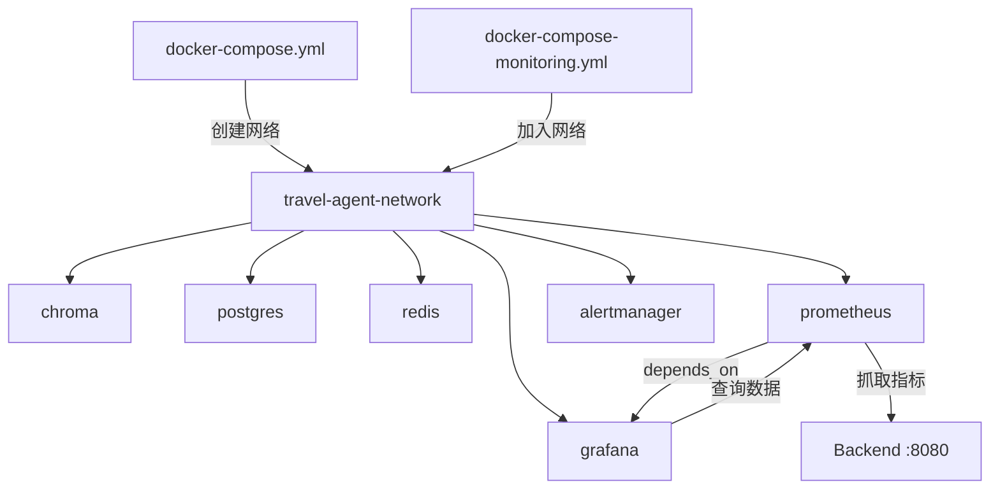

# 监控服务启动指南

## 📋 配置说明

### 网络架构（已优化）

所有服务现在使用**统一的共享网络** `travel-agent-network`：

```
travel-agent-network (共享网络)
├── chroma (向量数据库)
├── postgres (PostgreSQL + pgvector)
├── redis (缓存)
├── prometheus (监控数据收集)
├── grafana (可视化)
└── alertmanager (告警管理)
```

**优势**：
- ✅ 所有容器可以通过容器名互相访问
- ✅ Grafana 可以直接访问 Prometheus
- ✅ Prometheus 可以访问后端应用（通过 host.docker.internal）
- ✅ 符合 Docker Compose 最佳实践

---

## 🚀 启动步骤

### 方法 1: 分步启动（推荐用于开发）

```bash
# 1. 启动主服务（数据库、缓存等）
cd infra/docker
docker compose -f docker-compose.yml up -d

# 2. 验证主服务网络已创建
docker network ls | grep travel-agent-network

# 3. 启动监控服务（会自动加入 travel-agent-network）
docker compose -f docker-compose-monitoring.yml up -d

# 4. 验证所有服务状态
docker compose -f docker-compose.yml ps
docker compose -f docker-compose-monitoring.yml ps
```

### 方法 2: 一键启动所有服务

```bash
cd infra/docker
docker compose -f docker-compose.yml -f docker-compose-monitoring.yml up -d
```

---

## 🔄 重启现有服务（应用新配置）

如果你已经有运行中的容器，需要重新创建以应用新配置：

```bash
cd infra/docker

# 1. 停止并删除旧的监控容器
docker compose -f docker-compose-monitoring.yml down

# 2. 确保主服务网络存在
docker compose -f docker-compose.yml up -d

# 3. 重新启动监控服务（使用新配置）
docker compose -f docker-compose-monitoring.yml up -d

# 4. 验证网络连接
docker network inspect travel-agent-network
```

---

## ✅ 验证配置

### 1. 检查所有容器是否在同一网络

```bash
# 查看 travel-agent-network 中的所有容器
docker network inspect travel-agent-network --format '{{range .Containers}}{{.Name}} {{end}}'
```

**预期输出**（应包含）：
```
travel-agent-chroma
travel-agent-postgres
travel-agent-redis
travel-agent-prometheus
travel-agent-grafana
travel-agent-alertmanager
```

### 2. 测试 Grafana 到 Prometheus 的连接

```bash
# 从 Grafana 容器内测试连接
docker exec travel-agent-grafana wget -O- --timeout=5 \
  'http://travel-agent-prometheus:9090/api/v1/query?query=up' 2>&1 | grep success
```

**预期输出**：
```
{"status":"success",...}
```

### 3. 测试 Prometheus 到后端的连接

```bash
# 从 Prometheus 容器内测试连接
docker exec travel-agent-prometheus wget -O- --timeout=5 \
  http://host.docker.internal:8080/actuator/health 2>&1 | grep status
```

**预期输出**：
```
{"status":"UP",...}
```

---

## 🌐 访问地址

| 服务 | 地址 | 账号 |
|------|------|------|
| **Prometheus** | http://localhost:9090 | 无需登录 |
| **Grafana** | http://localhost:3000 | admin / admin |
| **Alertmanager** | http://localhost:9093 | 无需登录 |
| **Chroma** | http://localhost:8000 | 无需登录 |
| **PostgreSQL** | localhost:5432 | postgres / postgres |
| **Redis** | localhost:6379 | 无密码 |

---

## 🔧 Grafana 数据源配置

### Prometheus 数据源设置

1. 访问 http://localhost:3000
2. 登录（admin / admin）
3. 导航到：**Configuration** → **Data Sources** → **Add data source** → **Prometheus**
4. 配置：
   ```
   Name: Prometheus
   URL: http://travel-agent-prometheus:9090
   Access: Server (default)
   ```
5. 点击 **"Save & test"**
6. 应该看到：✅ "Successfully queried the Prometheus API."

**为什么使用 `travel-agent-prometheus` 而不是 `localhost`？**
- Grafana 容器内的 `localhost` 指向容器自身，不是宿主机
- 在 Docker 网络内，容器通过**容器名**互相访问
- `travel-agent-prometheus` 是 Prometheus 容器的名称

---

## 🐛 常见问题

### Q1: Grafana 无法连接 Prometheus

**错误信息**：
```
Post "http://prometheus:9090/api/v1/query": dial tcp: lookup prometheus on 127.0.0.11:53: no such host
```

**原因**：容器名不匹配或不在同一网络

**解决方案**：
```bash
# 1. 检查 Prometheus 容器名
docker ps | grep prometheus
# 应该是 travel-agent-prometheus

# 2. 检查两个容器是否在同一网络
docker network inspect travel-agent-network

# 3. 在 Grafana 中使用正确的 URL
# URL: http://travel-agent-prometheus:9090
```

### Q2: Prometheus 无法抓取后端指标

**错误信息**：
```
Get "http://host.docker.internal:8080/actuator/prometheus": dial tcp: lookup host.docker.internal: no such host
```

**原因**：Linux 系统默认不支持 `host.docker.internal`

**解决方案**：
- ✅ 已在 `docker-compose-monitoring.yml` 中添加 `extra_hosts` 配置
- 重新创建容器即可生效

### Q3: 端口冲突

**错误信息**：
```
Error starting userland proxy: listen tcp4 0.0.0.0:3000: bind: address already in use
```

**解决方案**：
```bash
# 方法 1: 修改端口映射
# 编辑 docker-compose-monitoring.yml
# 将 "3000:3000" 改为 "3001:3000"

# 方法 2: 停止占用端口的服务
lsof -ti:3000 | xargs kill -9
```

---

## 📊 健康检查

所有服务都配置了健康检查，可以通过以下命令查看：

```bash
# 查看所有容器健康状态
docker ps --format "table {{.Names}}\t{{.Status}}"

# 查看特定容器的健康检查日志
docker inspect travel-agent-prometheus | grep -A 10 Health
```

**健康状态说明**：
- `healthy` - 服务正常运行 ✅
- `unhealthy` - 服务异常 ❌
- `starting` - 正在启动中 ⏳

---

## 🔄 服务依赖关系



**启动顺序**：
1. `docker-compose.yml` 创建网络和基础服务
2. `docker-compose-monitoring.yml` 加入网络并启动监控服务
3. Prometheus 等待健康检查通过
4. Grafana 启动并连接 Prometheus

---

## 📝 最佳实践

### 1. 开发环境
```bash
# 使用分离模式启动，查看日志
docker compose -f docker-compose.yml up -d
docker compose -f docker-compose-monitoring.yml up -d

# 查看实时日志
docker compose -f docker-compose-monitoring.yml logs -f prometheus grafana
```

### 2. 生产环境
```bash
# 修改 Grafana 默认密码
# 编辑 docker-compose-monitoring.yml
environment:
  - GF_SECURITY_ADMIN_PASSWORD=your_strong_password_here

# 限制资源使用
# 在每个服务下添加：
deploy:
  resources:
    limits:
      cpus: '0.5'
      memory: 512M
```

### 3. 数据持久化
所有重要数据都已配置 Docker Volume：
- `prometheus-data` - Prometheus 时序数据
- `grafana-data` - Grafana 配置和仪表板
- `postgres-data` - PostgreSQL 数据
- `redis-data` - Redis 持久化数据

**备份命令**：
```bash
# 备份 Prometheus 数据
docker run --rm -v prometheus-data:/data -v $(pwd):/backup \
  alpine tar czf /backup/prometheus-backup.tar.gz -C /data .

# 备份 Grafana 数据
docker run --rm -v grafana-data:/data -v $(pwd):/backup \
  alpine tar czf /backup/grafana-backup.tar.gz -C /data .
```

---

## 🎯 下一步

1. ✅ 启动所有服务
2. ✅ 配置 Grafana Prometheus 数据源
3. ✅ 导入预配置的 Dashboard（如果有）
4. ✅ 配置告警规则
5. ✅ 测试端到端监控流程

---

**文档版本**: 1.0  
**最后更新**: 2026-02-01  
**维护者**: Pathfinder Agent Team
